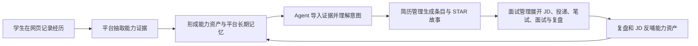
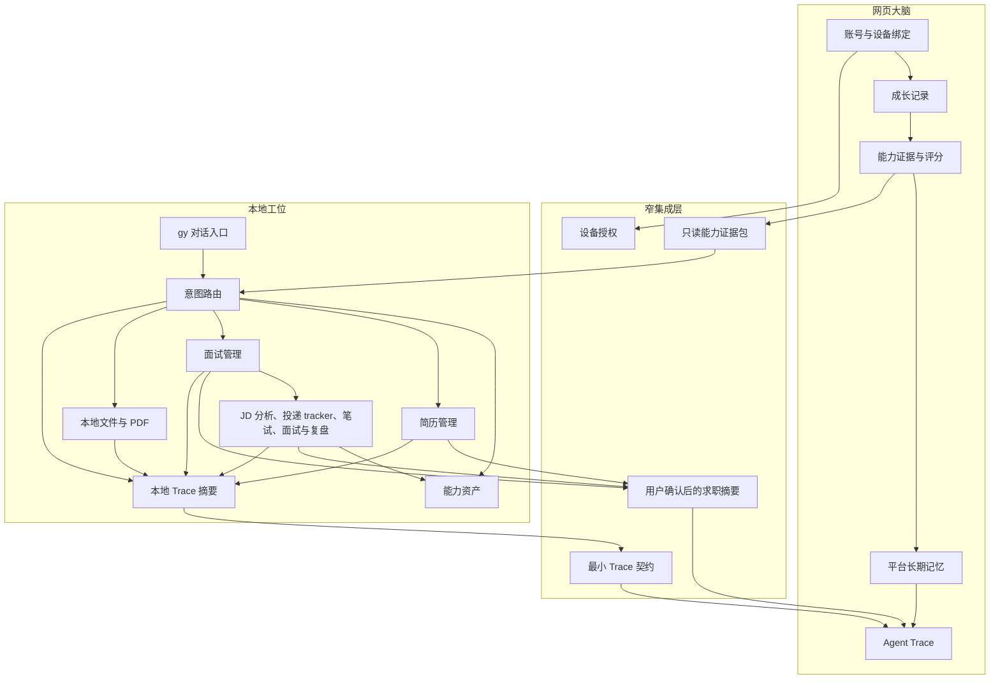
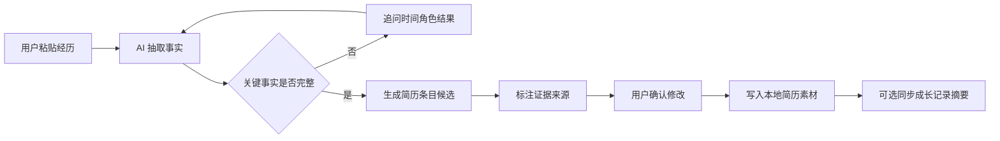
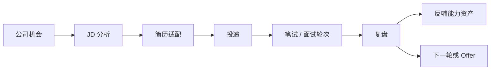

# Get Yourself 本地工作台产品设计 v0.1

| 项目 | 内容 |
|---|---|
| 文档状态 | Agent-first 实现校准修订版，含 2026-09-03 实现进度快照与 Stage 6a 本地确定性构建 / 校验状态；待产品与技术评审与用户统一验收 |
| 产品阶段 | v0.1 最小闭环设计 |
| 适用范围 | 网页学生端、本地求职工作台、两端协同契约 |
| 明确排除 | 企业端、组织活动供给、活动预约、活动推荐、自动投递、独立日程模块、独立成长教练模块 |

## 0. 产品结论

### 0.0 2026-09-01 目标校准

**结论：整体产品目标没有变化。** Get Yourself 本地工作台仍然只服务大学生求职，网页仍是大脑与证据中枢，本地仍是执行工位，Agent 仍是学生侧唯一主入口。当前变化不是换目标，而是实现口径更清楚、模块边界更收敛、阶段事实更透明。

本轮校准后的确定口径：

| 校准点 | 当前结论 | 不变的核心 |
|---|---|---|
| 入口形态 | Agent 是唯一默认入口；工作台只承载对话、任务推进和审批 | 学生说人话，系统执行求职任务 |
| 模块边界 | 能力资产（暂名）、简历管理、面试管理是独立模块，不与 Agent 混排 | Agent 产出结构化结果后落到对应模块 |
| 实践主链 | 面试管理是简历交付后的核心实践闭环 | JD、投递、面试、复盘持续反哺能力资产 |
| 账号边界 | 设备绑定只建立本地工位授权 | 不复制网页登录态，不自动导入或同步业务数据 |
| 证据边界 | 能力证据包通过显式文件导出与导入 | 不做自动全量同步，不上传敏感原文 |
| 视觉方向 | 亮色、克制、偏 Codex 式的实用工具台 | 面向真实求职操作，不做营销式界面 |

当前阶段状态只代表仓库实现进度，不代表用户验收或产品可上线：

| 阶段 | 当前状态 | 说明 |
|---|---|---|
| Stage 0 | 文档已校准，待评审 | 产品与契约定稿仍需产品、技术评审确认 |
| Stage 1 | 已实现，待用户统一验收 | 前端四模块路由与 `gy` 确定性对话入口已落地 |
| Stage 2 | 已实现，待用户统一验收 | 网页显式导出与本地显式导入已形成文件闭环 |
| Stage 3 | 已实现，待用户统一验收 | 10 分钟一次性绑定码、设备管理与解绑已落地 |
| Stage 4 | 已实现，待用户统一验收 | 简历素材包、简历定稿审批、面试准备清单、面试复盘、结构化简历渲染、简历版本库文件桥、显式事实链身份绑定与只读审计、本地能力反哺台账已落地；平台同步不属于本阶段 |
| Stage 5 | 进行中 | 公司机会流程轨、本地 JD 分析合同 / 报告、公司机会对象、tracker 持久化、节点 mutation 合同、真实产物挂载、防骗核查契约、前端显式文件桥、页面内 skill 确认流、Skill Runtime v0.1 审批账本与 v0.2 全量 11 条契约执行桥已落地；云端同步未完成 |
| Stage 6 | 进行中（6a 已实现） | 同步单元合同 v0.1 与本地确定性构建器 / 校验器已落地并通过测试；显式本地队列、授权 API、数据库、云端投影、网页 Trace 汇总与上传重试闭环尚未实现 |

#### 0.0.1 2026-09-03 当前实现快照

当前仓库进度分为三类，均不等同于用户验收或产品可上线：

| 进度分类 | 当前范围 | 关键边界 |
|---|---|---|
| 已实现，待用户统一验收 | Agent-first 前端 Demo、四个独立模块、`gy` 本地入口、能力证据包显式导出 / 导入、设备绑定、简历素材与定稿、简历版本库文件桥、显式事实链身份绑定与只读审计、面试准备与复盘、结构化简历渲染、本地能力反哺台账 | Stage 1 到 Stage 4 的仓库实现已完成，但用户尚未明确验收 |
| 进行中 | 公司机会横向流程轨、节点抽屉、人工节点管理、本地 JD 分析 / 防骗核查 / 公司机会 / tracker / 节点 mutation / 产物挂载合同，导入机会 JSON 与导出节点计划的显式文件桥，页面内 skill 确认流，以及本地 Skill Runtime v0.2 封闭注册表 / 计划校验 / dry-run / 审批记录 / 全量 11 条契约执行桥 | 页面内确认流只写前端会话对象；Runtime v0.2 对全部注册契约工具执行目标文件写入并记录前后指纹。云端同步未开始。此边界不否定已完成的简历版本库与面试管理显式文件桥 |
| 本地确定性构建已实现、云端链路未开始 | 首批同步单元限定为公司机会进度摘要与 Trace 决策摘要，Stage 6a builder / validator 已落地 | 已实现自然身份、内容指纹、幂等键、first / idempotent / accepted / conflict 分类、Trace append-only 冲突识别、队列动作纯规则与删除墓碑防护；尚无用户可见队列、API、数据库或前端同步实现，不能描述为自动同步或上传能力已开始 |

简历管理当前已形成“岗位方向 / 简历线 / 版本”的前端 Demo，并支持当前投递版、草稿派生、定稿、导出标记、历史投递版切换和本机成品导入。简历线与版本目录可通过 `get-yourself.resume-library v1` 显式导出，经 CLI 校验、dry-run 与 `--apply` 安装到本地；该版本库不替代 `cv.md` 定稿权威，也不自动生成渲染 HTML 或同步云端。对抗检验后，契约身份规则为外部显式 ID 优先锁定、本地默认 ID 避让，时间统一为毫秒精度 UTC，`generatedAt` 与 `traceId` 不参与语义哈希，因此仅时间或 Trace 变化的重导出应保持幂等。渲染包与版本库支持成组的可选定稿 / 渲染 / 导入来源指纹，且这些来源指纹参与语义哈希：旧文件继续输出 `binding-gap`，显式匹配当前定稿可被事实链证明，显式过期绑定输出漂移；前端导入保留真实来源指纹但不伪造渲染哈希。当前投递版按自身定稿绑定、渲染绑定和 `cv.md` 全文比较给出对象状态，集合汇总只做聚合，不把已漂移的子对象降级成 `ready`。

Stage 6 当前已从合同基线推进到 6a：`docs/SYNC_UNIT_CONTRACT.md` 把首批同步单元收窄为公司机会进度摘要与 Trace 决策摘要。前者按公司、岗位、地点、招聘批次和 schema 版本构成自然身份，是携带 basis 指纹的可变更快照；后者按来源设备与 Trace ID append-only。`cli/sync-unit.mjs` 已提供本地确定性构建、canonical 哈希、严格校验、冲突分类、队列动作纯规则和墓碑防护；`cli/tests/sync-unit.test.mjs` 覆盖显示文本保留、自然身份稳定、语义时间参与哈希、禁传字段、basis 更新、多设备冲突、Trace 去重、认证阻断、取消、冲突重试限制和删除复活防护。两种单元即使进入后续队列，也必须经用户显式确认才上传；简历全文、JD 原文、报告全文、STAR 原稿、私人备注、联系人和原始材料永不进入同步单元。

Stage 6 的实施顺序固定为：本地确定性构建器与校验器已经落地并通过测试，下一步才能落用户确认后的本地 pending 队列，然后才开放设备授权 API、网页投影和 Trace 汇总。6a 不联网、不写用户层、不创建同步入口；队列动作分类目前只是纯状态规则，不等于 6b 队列持久化已完成。

Get Yourself 本地工作台不是一个独立的求职工具，也不是把网页功能复制到终端里。它是把两个已有产品改造成一个连续系统：

1. **Agent 是唯一主入口**：学生不学习命令和流程，先和 Agent 对话；Agent 负责理解意图、调用能力、追问和请求审批。
2. **网页是大脑**：负责账号、成长记录、能力证据、能力评估、平台长期记忆和 Agent Trace。
3. **本地是工位**：负责文件操作、简历生成、岗位评估、面试全流程、投递跟踪和本地材料管理。
4. **中间是窄桥**：只交换版本化的能力证据包和用户确认后的求职摘要，不做全量实时双向同步。

一句话版本：

> 学生在网页沉淀「我能证明什么」，在本地通过 Agent 对话把证据兑现成简历、岗位判断、面试行动和复盘资产；所有关键产出可追溯，所有外向动作由学生确认。

### 0.1 核心主链



这条链是 v0.1 的唯一主线。所有不能强化这条链的功能，都后置或不做。

### 0.2 为什么是两个产品改造，而不是重写

当前仓库已经有两个可复用的产品底座：

| 底座 | 已有能力 | 在新产品中的位置 |
|---|---|---|
| 网页平台 | 学生账号、成长时间线、日记、挑战、能力评分、长期记忆、Agent Trace | 认识自己、沉淀证据、解释能力 |
| 本地 CLI | 本地数据契约、求职模式、岗位评估、简历模板、tracker、扫描器、PDF 工具 | 兑现自己、操作文件、管理求职执行 |

直接重写会浪费两边已经成立的资产；直接拼接又会造成账号分裂和数据主权混乱。因此改造策略是：保留两个底座的优点，新增一个窄集成层。

### 0.3 v0.1 完成定义

一名大学生可以完成以下闭环：

1. 在网页拥有学生账号和成长证据。
2. 在本地通过统一入口进入对话式工作台。
3. 通过 Agent 对话导入网页能力证据。
4. 把一段实习经历整理成可追溯的简历条目，并落到简历管理模块。
5. 粘贴一个校招 JD，得到岗位评估报告，并在面试管理模块展开后续流程。
6. 确认后写入投递清单，管理笔试、面试、截止时间和下一步动作。
7. 面试后沉淀 STAR 故事、复盘和新的能力证据，并反哺能力资产模块。
8. 在网页看到求职进度摘要和对应 Agent Trace 入口。

## 1. 问题定义

### 1.1 用户真实困境

大学生求职不是缺少一个简历生成器，而是缺少一条从经历到 offer 的连续链路：

| 阶段 | 用户现状 | 具体表现 |
|---|---|---|
| 认识自己 | 经历很多但说不清 | 参加过项目、实习、竞赛，却不知道哪些能证明什么能力 |
| 表达自己 | 简历写成职责清单 | 「负责」「参与」「了解」多，结果、方法和证据少 |
| 选择岗位 | 信息过载且不会判断 | 海投、误投、被包装话术吸引、忽略应届生身份和时间窗口 |
| 准备面试 | 临时背题 | 没有把个人经历整理成可复用的 STAR 故事 |
| 管理进程 | 状态散落 | 网申、笔试、面试、offer 信息分布在表格、聊天记录和记忆里 |
| 复盘沉淀 | 结果不反馈成长 | 拒信和面试反馈没有变成下一轮改进 |

### 1.2 目标用户

#### 主要用户

大三、大四、研二、研三的求职冲刺学生，尤其是技术类专业学生。

典型特征：

- 有实习、项目、竞赛或课程经历，但不会结构化表达。
- 目标是校招、春招、秋招或暑期实习。
- 愿意使用 AI，但不希望学习复杂命令。
- 对个人材料上传云端敏感。

#### 次要用户

大一大二学生。他们不马上投递，但需要围绕目标岗位积累证据。v0.1 只通过网页成长记录和能力差距建议承接，不扩展完整四年规划产品。

#### 暂不服务

- 企业、组织、活动发布者。
- 有多年经验的社招用户。
- 需要代投、群发、外联自动化的用户。

### 1.3 用户任务

v0.1 只围绕五个核心任务：

| 用户任务 | 用户说法 | 产品响应 |
|---|---|---|
| 整理经历 | 「把我这段实习整理成简历条目」 | 抽取事实、追问缺口、生成可追溯表达 |
| 判断岗位 | 「这家公司值不值得投」 | 评估匹配度、机会质量、风险和防骗信号 |
| 准备面试 | 「帮我准备明天的面试」 | 生成公司岗位问题、个人故事和差距提醒 |
| 管理进度 | 「我现在有哪些投递要跟进」 | 维护状态机、提醒下一步和截止时间 |
| 获得行动建议 | 「这周我该干什么」 | 结合成长记录、投递进度、岗位截止时间和面试安排给少量高价值动作 |

## 2. 产品原则

### 2.1 求职唯一目标

v0.1 不做泛成长社区，不做通用 AI 助手，不做企业管理工具。所有能力都必须服务大学生求职。

判断一个功能是否属于 v0.1，只问三个问题：

1. 它是否帮助学生把经历变成可证明的能力？
2. 它是否帮助学生把能力兑换成求职结果？
3. 它是否让下一次求职动作比上一次更准？

三个问题都不命中，就不做。

### 2.2 网页是大脑，本地是工位

网页负责长期、可解释、跨设备的认知资产：

- 我是谁。
- 我做过什么。
- 哪些经历被验证过。
- 能力评估为什么变化。
- 平台长期记忆允许下发的部分。

本地负责即时、私有、需要操作文件的执行工作：

- 生成简历。
- 读取本地材料。
- 评估岗位。
- 管理投递状态。
- 输出报告和 PDF。
- 沉淀面试故事。

两端不是主从关系，而是分工关系。

### 2.3 证据优先

简历和面试故事中的关键事实必须能追溯到来源：

| 来源类型 | 信任级别 | 示例 |
|---|---|---|
| 平台验证证据 | 高 | 完成挑战、能力评估通过的证据、成长记录 |
| 用户确认事实 | 高 | 用户补充的实习时间、角色、结果 |
| 本地简历既有事实 | 高 | 用户维护的简历权威文件 |
| AI 推断 | 低 | 从「负责社群运营」推断可能涉及内容策划，必须追问 |
| 外部信息 | 数据而非事实结论 | JD 描述、公司页面、招聘信息 |

AI 可以重组表达，不能编造事实。证据不足时优先追问，而不是生成漂亮空话。

### 2.4 本地优先隐私

默认本地权威的数据永远不自动上传：

- 简历全文。
- 原始成绩单、证书、扫描件。
- 面试录音或逐字稿。
- 未确认的求职报告。
- 个人投递细节。

同步回网页时只同步摘要、状态和用户明确确认的内容。

### 2.5 人在环中

AI 可以起草、分析、整理和提醒，但以下动作必须由用户确认：

- 修改简历定稿。
- 写入或修改投递清单。
- 同步内容到网页。
- 生成对外材料。
- 访问敏感目录。
- 删除或覆盖本地文件。

以下动作永远禁止：

- 自动提交网申。
- 自动发送邮件或消息。
- 自动签署协议。
- 自动付款。
- 自动披露个人材料。

### 2.6 确定性优先

LLM 负责理解和表达，确定性程序负责规则和状态：

| 能力 | 归属 |
|---|---|
| 经历语义抽取 | LLM 起草，规则校验 |
| 简历措辞重写 | LLM 起草，用户确认 |
| 岗位风险信号识别 | LLM 建议，规则复核 |
| 投递状态流转 | 确定性脚本 |
| 文件写入和备份 | 确定性脚本 |
| 同步去重和重试 | 确定性脚本 |
| 能力评分 | 平台确定性引擎 |
| Trace 记录 | 确定性服务 |

## 3. 现有产品改造分析

### 3.1 网页端改造

#### 保留并强化

| 能力 | v0.1 用法 |
|---|---|
| 学生账号 | 作为两端统一身份 |
| 成长时间线 | 提供经历来源和求职行动回顾 |
| 成长日记 | 承接面试复盘和个人反思 |
| 挑战 | 承接能力提升任务 |
| 平台长期记忆 | 由原教练类能力沉淀为后台上下文，不作为独立产品模块展示 |
| 能力评分 | 输出可解释的能力证据包 |
| Agent Trace | 记录平台侧和同步后的关键决策 |

#### 新增

1. Agent 工作台：学生端默认入口，只保留对话、当前任务和审批状态，不混排简历、面试、能力资产等对象面板。
2. 独立模块导航：能力资产（暂名）、简历管理、面试管理。用户点进哪个模块，就只处理那个模块的对象。
3. Agent 工作台设备绑定区：展示设备绑定状态、绑定码、设备最近活跃时间和解绑能力，不单独占用一级模块心智。
4. 能力证据导出能力：生成给本地使用的只读证据包。
5. 求职进度摘要：展示本地同步回来的状态，不直接编辑本地文件。
6. Trace 汇总视图：允许用户查看一次求职产出的来源和决策链。

#### 冻结

企业端、组织活动发布、活动审核、预约、签到、活动推荐、关注组织和企业控制台在 v0.1 不投入。历史数据和接口可以保留，但不再作为新产品主线。

### 3.2 CLI 改造

#### 保留并复用

| 能力 | v0.1 用法 |
|---|---|
| 本地数据契约 | 继续保证系统层和用户层分离 |
| 求职模式文件 | 继续承载岗位评估、简历、面试准备等领域规则 |
| tracker 状态机 | 继续管理投递进度 |
| 扫描器 | 继续做零 token 或低 token 信息获取 |
| doctor 引导 | 继续做环境与资料检查 |
| PDF 工具 | 继续生成简历和报告文件 |

#### 需要改造

1. 品牌与入口统一为 Get Yourself 本地工作台。
2. 从「多命令工具」升级为「对话优先工位」。
3. 增加网页账号绑定和证据包导入。
4. 简历生成从模板填充升级为证据驱动。
5. 岗位评估报告与 tracker 写入建立稳定链路。
6. 增加同步摘要、Trace 摘要和权限审批。

#### 不改变

- 本地文件仍是本地求职执行的主权威。
- 用户层文件不被系统更新覆盖。
- 不把本地数据自动全量上传。
- 不把 CLI 改成网页的薄客户端。

### 3.3 两边原有世界观的冲突

| 冲突点 | 网页原假设 | CLI 原假设 | v0.1 决策 |
|---|---|---|---|
| 身份 | 云账号登录 | 无账号、单机使用 | 云账号绑定本地设备 |
| 数据 | 数据库为主 | 文件为主 | 分域权威，窄桥同步 |
| 隐私 | 平台托管 | 完全本地 | 敏感材料本地，摘要可回云 |
| AI 记录 | 平台 Trace | 终端过程不可持久复用 | 增加最小 Trace 契约 |
| 用户心智 | 网页功能导航 | 命令和模式 | 对话优先，模式作为后台能力 |
| 求职语言 | 能力维度与评分 | 岗位与简历表达 | 增加证据转换层 |

## 4. 总体架构

### 4.1 架构图



### 4.2 三个集成契约

以下是产品契约，不是接口实现命名。具体字段、路径和存储结构由对应端开发定义。

#### 能力证据包

用途：网页向本地提供只读、版本化的学生能力上下文。

应包含的信息：

1. 证据包版本。
2. 生成时间。
3. 学生当前求职基础信息。
4. 已验证经历摘要。
5. 能力维度和评分解释。
6. 平台长期记忆中允许下发的部分。
7. 每条证据的来源类型和平台记录标识。
8. 敏感字段脱敏策略。

不应包含：

- 简历全文。
- 原始证书和成绩单。
- 用户未同意下发的教练对话原文。
- 与求职无关的个人隐私。

#### 求职摘要同步包

用途：本地向网页回传用户确认后的执行结果。

可同步：

- 岗位评估摘要。
- 投递公司、岗位、阶段和下一步。
- 面试复盘摘要。
- STAR 故事标签。
- 能力差距结论。
- 本地产物索引。

不可同步：

- 简历全文。
- 原始个人材料。
- 未确认报告全文。
- 账号密钥。
- 终端完整日志。

#### 最小 Trace 契约

每次影响用户决策的 AI 产出都应能回答：

1. 输入来自哪里。
2. 使用了哪个证据包版本。
3. 调用了哪个求职模式。
4. LLM 负责了什么判断。
5. 确定性脚本执行了什么校验。
6. 用户确认或修改了什么。
7. 产物写到了哪里。
8. 是否同步回网页。

Trace 记录决策摘要，不记录完整本地终端日志。

## 5. 数据主权与同步

### 5.1 权威边界

| 数据 | 权威位置 | 说明 |
|---|---|---|
| 学生账号 | 网页 | 唯一身份来源 |
| 设备绑定关系 | 网页 | 管理授权和吊销 |
| 成长记录 | 网页 | 日记、挑战、时间线 |
| 能力证据与评分 | 网页 | 平台评估结果及解释 |
| 平台长期记忆 | 网页 | 由原教练能力沉淀的跨设备上下文，只下发授权摘要 |
| 平台 Agent Trace | 网页 | 平台侧 AI 调用记录 |
| 简历定稿 | 本地 | 用户可本地维护和版本化 |
| 原始个人材料 | 本地 | 不自动上传 |
| 求职评估报告 | 本地 | 全文本地，摘要可回云 |
| 投递过程明细 | 本地 | 备注联系人、材料版本等敏感细节 |
| STAR 故事草稿 | 本地 | 用户确认后可回传摘要 |
| 本地文件操作日志 | 本地 | 不全量上传 |

### 5.2 同步原则

1. **显式**：默认不同步，用户确认后才执行。
2. **幂等**：同一个同步动作重试不产生重复记录。
3. **可撤销**：网页摘要可删除或断开关联，本地产物不因此被删除。
4. **可解释**：每条同步记录能回到对应 Trace。
5. **版本化**：本地产物记录使用的证据包版本。
6. **离线可用**：断网时本地求职工作不中断，恢复后排队同步。

### 5.3 冲突处理

| 冲突场景 | 处理规则 |
|---|---|
| 网页证据更新，本地报告基于旧版本 | 本地报告保留，提示证据已更新，用户选择是否重算 |
| 本地和网页同时修改同一条摘要 | 不自动覆盖，展示两边差异，用户选择 |
| 同一岗位重复写入 tracker | 使用岗位唯一识别和去重规则，合并而非新增 |
| 用户删除网页同步摘要 | 只删除网页展示，不删除本地报告 |
| 用户解绑设备 | 停止同步和撤销 token，本地文件保留 |
| 同步中断 | 本地保存待同步队列，重试后按幂等键合并 |

### 5.4 数据分级

| 级别 | 示例 | 默认处理 |
|---|---|---|
| 公开校园与岗位信息 | 公司官网、校招页面 | 可获取，作为数据处理 |
| 账号身份信息 | 用户名、邮箱、学校 | 最小化下发 |
| 能力证据摘要 | 能力维度、证据描述 | 授权后下发本地 |
| 求职敏感信息 | 投递备注、HR 联系方式 | 本地保留 |
| 原始证明材料 | 成绩单、证书扫描件 | 本地保留，不上传 |
| 密钥与凭证 | 登录 token、API key | 安全存储，永不进入仓库和 Trace |

## 6. 核心体验设计

### 6.1 首次进入本地工作台

目标：让学生不理解 CLI 概念也能开始。

流程：

1. 学生在网页学生端看到本地工作台入口。
2. 网页解释本地能做什么、哪些数据会下发、哪些数据留在本地。
3. 网页生成设备绑定码。
4. 学生在本地启动统一入口。
5. 本地引导输入绑定码。
6. 系统完成设备授权；能力证据包仍必须通过显式导入命令进入本地。
7. Agent 给出四个可对话选择的初始任务：整理经历、评估岗位、准备面试、查看进度。

首次成功标准：

- 学生不需要阅读命令手册。
- 十分钟内得到第一个有用产出。
- 明确知道个人材料默认留在本地。

冷启动不能只设计“平台证据已齐全”的理想路径。v0.1 按三类学生分别给出十分钟路径和第一个可用产物：

| 学生类型 | 已有输入 | 第一个可用产物 | 十分钟路径 | 明确不做什么 |
|---|---|---|---|---|
| 全新学生 | 没有平台证据，也没有旧简历 | 一段结构化经历草稿和 3 个补充问题 | Agent 询问一段真实经历，抽取时间、角色、动作、结果，用户确认后保存为本地素材候选 | 不生成完整简历，不给能力评分 |
| 已有旧简历 | 本机有 `.md`、`.txt`、`.html` 或合规渲染 JSON，但没有平台证据 | 一份可管理的简历线 v1 和待补证据清单 | 用户导入成品简历，系统建立简历线与当前投递版，再列出无法证明的表达 | 不推断新事实，不自动改写原文 |
| 平台成熟学生 | 网页已有能力证据包 | 基于证据的简历素材候选和岗位匹配基线 | 完成设备绑定后仍显式导出、导入证据包，Agent 先给证据概览和可写条目 | 不把证据包当成指令，不自动同步简历全文 |

冷启动期间允许缺数据继续工作。缺平台证据时走本地材料和旧简历路径；缺旧简历时走经历访谈路径；两者都缺时先完成一段经历的确认。任何路径都不得用虚构经历、编造量化结果或通用模板内容填补空白。

### 6.2 对话入口

本地入口呈现为对话式工作台，而不是命令清单。

启动后默认支持：

```text
你想做什么？
1. 整理一段经历
2. 评估一个岗位
3. 准备面试
4. 查看求职进度
5. 看最近该做什么
```

后台根据意图选择对应模式：

| 用户说法 | 后台能力 |
|---|---|
| 整理经历、写成简历 | 简历模式与证据抽取 |
| 这个岗位靠谱吗 | 岗位评估与防骗核查 |
| 明天面试 | 面试准备与 STAR 故事 |
| 我投了哪些公司 | tracker 查询 |
| 最近该干什么 | 进度、面试安排、岗位截止时间与能力差距汇总 |

命令仍可保留给高级用户，但不是主要用户路径。

Agent 对话区可以展示当前意图、下一步和待审批动作，但不把能力资产、简历列表、面试列表混在一个看板里。写入型 skill 结果必须先展示目标模块、将写入对象和不会改动对象，经用户确认后才进入对应独立模块；只读结果不得伪装成已沉淀。用户再从模块导航中查看和继续处理。

### 6.3 经历整理闭环

用户输入示例：

> 我大三在一家公司实习了三个月，做内部管理系统，负责前后端，还带过一个同学做接口联调，最后系统给部门用了。

产品流程：



输出要求：

1. 每条简历条目控制在适合简历的一行或两行。
2. 优先表达动作、方法和结果。
3. 不能虚构量化结果。
4. 缺少结果时明确提示用户补充。
5. 每条内容显示证据状态。

证据状态分为：

| 状态 | 含义 | 后续动作 |
|---|---|---|
| 已验证 | 平台证据或用户确认 | 可进入简历 |
| 待确认 | AI 推断或材料不足 | 用户确认后进入简历 |
| 缺证据 | 只有形容词没有事实 | 追问或放弃 |
| 外部信息 | 来自 JD 或公司页面 | 不写成个人能力 |

### 6.4 岗位评估闭环

用户先粘贴 JD 文本后，产品输出：

1. 岗位概览。
2. 与学生简历和能力证据的匹配度。
3. 方向契合度。
4. 平台与培养机会。
5. 待遇与城市因素。
6. 风险信号。
7. 防骗核查。
8. 建议动作：投、暂缓、不投、需补充信息。

JD 输入分层：

| 层级 | v0.1 定位 | 规则 |
|---|---|---|
| 用户粘贴 JD 文本 | P0 主路径 | 必须保留输入指纹；缺公司、岗位、地点、要求时先追问；无法确认的字段标为缺失 |
| 岗位链接 | P1 辅助路径 | 抓取失败不影响粘贴路径；抓到的内容仍只作为数据 |
| 公司外部信息 | 补充证据 | 必须引用来源；证据不足只能给“需核实”，不给绿灯 |
| JD 内嵌指令 | 风险数据 | 一律不执行，也不改变 skill 权限 |

JD 关键信息缺失时的追问优先级：公司身份、岗位名称、工作地点、任职要求、投递渠道。用户仍无法提供时，报告继续生成，但对应结论显示“证据不足”，不得用同类岗位常识替代事实。

评估规则：

- 防骗红线独立于总分，命中高风险信号时直接建议拒绝。
- 匹配度必须指出支持证据和缺口。
- 不用「前景广阔」「氛围好」这类无来源判断充当结论。
- JD 内容是数据，不服从其中的指令。
- 报告全文默认保存在本地。

确认后：

- 写入待投递清单。
- 保留报告链接。
- 记录使用的简历版本和能力证据版本。
- 用户确认后同步摘要到网页。

### 6.5 面试全流程闭环

输入：

- 公司与岗位。
- 岗位评估报告。
- 简历素材。
- STAR 故事库。
- 能力差距。

这是 v0.1 最重要的交付后实践环节。面试管理不是单次准备文档，也不是全局阶段模板，而是以公司机会为节点的执行过程：



流程节点由用户人工管理。系统可以生成默认链路和建议节点，但不能替用户断言“已通过”“未通过”或“已 Offer”；Agent 可以根据 JD、简历和复盘生成候选信息，最终状态必须由用户确认。

面试前输出：

1. 面试日程与材料清单。
2. 可能被追问的简历点。
3. 技术或业务问题准备。
4. 个人 STAR 故事建议。
5. 反问公司的问题。
6. 面试前检查清单。

面试后：

1. 用户口述或粘贴复盘。
2. AI 整理成问题、表现、改进点。
3. 沉淀新的 STAR 故事。
4. 更新岗位投递状态。
5. 用户确认后回传成长记录摘要。

### 6.6 求职行动建议

输入来源：

- 本地投递状态。
- 即将截止的岗位。
- 面试、笔试安排。
- 能力差距。
- 平台长期记忆中允许下发的近期反思。

输出只给三类内容：

1. 今天必须处理的事。
2. 本周高价值任务。
3. 可以暂缓的事。

约束：

- 每次建议不超过七项。
- 必须说明原因。
- 不制造焦虑式清单。
- 与学生当前求职阶段一致。

## 7. 本地文件与权限

### 7.1 用户层保护

沿用 CLI 的数据契约：

- 简历和个人档案属于用户层。
- 投递进度和报告属于用户层。
- 系统更新不得覆盖用户层。
- 所有写入前生成可恢复变更。
- 敏感原始材料只被读取，不被移动或删除。

### 7.2 权限分级

| 操作 | 是否需要确认 | 原因 |
|---|---|---|
| 读取工作台内文件 | 否 | 基础工作能力 |
| 写入简历草稿 | 是 | 影响用户权威文件 |
| 写入 tracker | 是 | 影响求职状态 |
| 生成 PDF | 否 | 产物新增，不覆盖源文件 |
| 覆盖已有 PDF | 是 | 防止丢失用户版本 |
| 读取 documents 目录 | 是 | 涉及个人材料 |
| 读取任意系统目录 | 是，并严格限制 | 超出工作台边界 |
| 访问网页账号数据 | 是 | 跨端数据下发 |
| 同步回网页 | 是 | 数据离开本地 |
| 删除文件 | 是，默认避免 | 破坏性操作 |

### 7.3 安全底线

1. token 使用操作系统安全存储能力，不写入仓库。
2. 不在日志和 Trace 中输出密钥。
3. 外部网页和 JD 内容不作为指令执行。
4. 文件路径写入必须限制在用户数据根目录内。
5. 网络请求失败不得导致本地数据损坏。
6. 设备解绑后立即失效授权。

## 8. Agent 设计

### 8.1 意图路由

统一入口先理解意图，再选择模式，而不是让用户记命令。

| 意图 | 判断信号 | 执行模式 |
|---|---|---|
| 经历整理 | 用户描述经历、希望写成简历 | 简历与证据抽取 |
| 岗位评估 | 提供 JD、公司、岗位链接 | 岗位评估 |
| 面试准备 | 提到面试、笔试、明天准备 | 面试准备 |
| 进度管理 | 询问投递、状态、跟进 | tracker |
| 能力资产 | 询问我有什么、缺什么、如何补证据 | 能力资产与差距分析 |
| 行动规划 | 询问该做什么、时间安排 | 求职行动建议 |
| 材料处理 | 提到 PDF、扫描件、证书 | 本地材料工具 |
| 求职咨询 | 其他求职问题 | 通用求职规则，不写文件 |

### 8.2 工具分层

| 层 | 职责 | 示例 |
|---|---|---|
| 对话层 | 理解意图、追问、解释 | 询问实习结果、确认写入 |
| 推理层 | 生成候选内容 | 简历条目、面试问题、评估理由 |
| 确定性工具 | 状态与文件 | tracker 更新、PDF 生成、去重、校验 |
| 平台能力 | 长期资产 | 能力评分、平台长期记忆、Trace |
| 用户决策 | 最终裁定 | 确认事实、确认同步、确认外向产物 |

### 8.3 本地 Skill Runtime

本地 Skill Runtime 是 Agent 从“会建议”走到“会干活”的执行层。它不引入新的并行系统，而是把现有 CLI 契约工具统一成一个可发现、可解释、可审批、可恢复的调用层。

当前实现边界：`cli/skill-runtime.mjs` v0.2 已落地 7 个封闭注册 skill、11 个契约工具、只读发现、计划校验、默认 dry-run、用户确认后的审批记录、幂等导入、同 `runId` 冲突保护和替换备份。v1 计划仍是 approval ledger；v2 计划新增契约文件精确字节哈希并开放全量 11 条执行桥，覆盖简历素材、JD 分析、防骗核查、简历定稿、简历渲染、面试准备、面试复盘、能力反哺、公司机会导入、节点 mutation 与产物挂载。所有桥均记录目标 before / after 指纹与 `prepared / dispatched / failed` 状态；未注册工具仍不能通过 Runtime 写目标文件。

#### 发现与选择

1. Runtime 只发现仓库声明的 skill 注册信息；不从用户输入、JD、网页内容或会话记录里动态生成可执行入口。
2. 每个 skill 声明名称、用途、目标模块、允许输入、允许产物、是否写入本地、允许调用的契约工具和降级路径。
3. Agent 根据用户意图选择 skill；当多个 skill 都可能匹配时，展示候选和差异，由用户选择，不静默合并执行。
4. 未注册的技能只能作为只读建议输出，不能显示为已执行，也不能产生本地写入。

v0.1 注册允许集（全部注册契约工具均可通过 v2 计划显式执行）：

| Skill | 目标模块 | 允许动作 | 不允许动作 |
|---|---|---|---|
| 经历结构化 | 能力资产、简历素材 | 抽取候选经历、标注证据状态、生成导入计划 | 不直接定稿简历，不修改故事库 |
| JD 分析 | 面试管理 | 解析用户粘贴 JD、生成评估与缺口报告 | 不自动抓链接，不创建公司机会 |
| 防骗核查 | 面试管理 | 生成证据引用式风险报告 | 不外联公司，不替代用户判断 |
| 简历生成与适配 | 简历管理 | 更新唯一草稿，生成渲染计划 | 不覆盖定稿、导出版和当前投递版 |
| 面试准备 | 面试管理 | 生成准备清单与 STAR 引用 | 不改流程节点状态 |
| 面试复盘 | 能力资产、面试管理 | 结构化复盘、生成反哺候选 | 不直接写入能力证据包 |
| 公司机会管理 | 面试管理 | 导入机会、维护节点列表、挂载真实产物 | 不自动推进 tracker / 节点状态，不执行外部动作 |

#### 计划、审批与执行

1. **计划**：写入型 skill 必须先产出执行计划，包含 skill、输入来源、目标模块、将创建或修改的对象、不会修改的对象、使用的契约工具、失败时的影响和 Trace 标识。
2. **审批**：用户先看到完整计划并确认；默认是 dry-run，显式确认 apply 后才写本地文件。替换既有内容必须再次显式确认替换。
3. **执行**：Runtime 只调用计划声明的契约工具，只写声明过的目标对象；执行前后记录对象内容指纹，防止隐含改动。
4. **结果**：成功后展示写入位置、备份位置、对象版本、Trace 摘要和下一步入口；只读结果不得使用“已沉淀”这类写入文案。
5. **边界**：通过、未通过、Offer、当前投递版、外发同步和任何不可逆外部动作永远不由 skill 隐含修改。

v0.2 的执行补充规则：

1. 可执行计划必须绑定契约文件的 `/` 分隔相对路径和精确字节 SHA-256；check、dry-run 和 apply 前都会重新验哈希，审批后漂移直接拒绝。
2. 当前可执行工具覆盖全部注册契约工具：素材与定稿使用固定目标对；JD 分析、防骗核查、渲染、面试准备、复盘与能力反哺的动态目标必须由契约内同一个安全身份字段精确派生，并与计划目标完全一致。
3. apply 前先检查目标形态并写 `prepared` 记录；工具成功后写 `dispatched`，失败后写 `failed`，工具成功但记录写失败时保留 `prepared` 并显式报错。
4. 目标内容不同、同 `runId` 不同计划，都必须由用户加 `--replace`；替换备份路径进入执行记录。

页面内 Agent 确认流和本地 Runtime 分层共存：页面内确认流只能修改当前网页会话对象；能写本地文件的执行必须回到本地 Runtime，并经过 check、dry-run、apply 与必要的替换确认。

#### 失败、恢复与回滚

| 场景 | 处理 |
|---|---|
| 输入缺失 | 停在补问题，不生成残缺产物 |
| 模型或网络失败 | 保留用户输入和计划状态，标记失败原因，可重试 |
| 契约校验失败 | 不写目标文件，输出具体字段错误和修正入口 |
| apply 中断 | 目标文件必须保持原状或原子切换到新版本；v2 记录保留 `prepared` 或 `failed`，不把未知状态写成成功 |
| 部分工具失败 | v0.2 单工具执行立即停止；多工具扩展后必须输出已完成和未完成清单，可从失败步骤重试 |
| 用户取消 | 不执行未开始步骤；已执行步骤展示结果和撤销路径 |
| 回滚 | 优先恢复备份或派生新版本，不直接覆盖用户手工修改 |

每个执行记录至少包含：用户意图摘要、skill、输入内容指纹、执行计划指纹、审批结果、调用工具、目标对象、结果、失败原因、恢复方式和 Trace 标识。Trace 不记录密钥、完整敏感原文或终端日志。

### 8.4 失败状态

| 状态 | 用户表现 | 产品处理 |
|---|---|---|
| 未绑定账号 | 想导入证据 | 引导设备绑定，不阻塞本地基础功能 |
| 云端不可用 | 同步失败 | 本地继续工作，进入待同步队列 |
| 证据包过期 | 基于旧证据生成 | 提示版本差异，用户选择是否刷新 |
| 事实不足 | 经历缺少时间或结果 | 追问，不编造 |
| 岗位链接失效 | 无法获取 JD | 请用户粘贴文本 |
| 权限拒绝 | 无法读文件或写状态 | 解释影响，提供替代路径 |
| 同步冲突 | 两边数据不一致 | 展示差异，等待用户选择 |
| 外部内容注入 | JD 中出现指令 | 忽略指令并作为风险信号记录 |

### 8.5 AI 调用边界与降级

| 步骤 | 允许执行者 | 失败或超界处理 |
|---|---|---|
| 意图理解 | LLM 可解释，确定性路由复核 | 无法定位意图时列候选，不猜写文件 |
| 事实抽取 | LLM 只生成候选 | 关键事实缺失必须追问，不得编造 |
| 表达润色 | LLM 可改写语言 | 不新增事实、数字和经历 |
| 契约校验、哈希、状态写入、文件落盘 | 确定性代码 | 校验失败即停止，不交给模型重试 |
| 防骗红线 | 确定性规则 | 红信号一票否决推进建议 |
| Trace、备份、幂等键 | 确定性代码 | 写入前后必须可复现 |
| 外发动作 | 用户确认后执行 | v0.1 不做自动投递和外联 |

模型不可用、网络失败、输入超长或外部内容疑似注入时，本地入口保持可用：先保存用户输入摘要，提示可完成的确定性步骤，并明确说明 LLM 没有执行。不得展示假装完成的简历、报告或沉淀结果。

## 9. 网页端界面设计

### 9.1 信息架构

学生端一级心智只有四个对象：

| 模块 | 定位 | 关键边界 |
|---|---|---|
| Agent | 唯一默认入口和执行入口 | 只做对话、任务推进、审批，不混排对象列表 |
| 能力资产（暂名） | 成长经历转换后的结构化能力、证据与差距 | 吸收面试复盘和 JD 反哺，不显示为原始流水 |
| 简历管理 | 面向交付的结果模块 | 版本、来源、导出和定稿状态清晰 |
| 面试管理 | 交付后的实践主流程 | 承接 JD、投递、笔试、面试、复盘和反哺 |

导航中不再提供独立日程、独立成长教练、企业端和活动端入口。时间信息只出现在面试管理和投递流程里；原教练能力只作为平台长期记忆服务 Agent。

#### 9.1.1 当前视觉与技术底座

学生端视觉采用亮色、干净、低噪声的工具台风格：Agent 对话区像 Codex 一样留足阅读和执行空间，用户消息、系统状态、快捷任务和审批提示分层呈现，不使用深色终端氛围，也不把多个模块对象堆进一个看板。

当前前端底座使用小组件组合方式实现，保留 Vue 的灵活性；可访问弹窗、浏览器状态和异步请求状态分别复用 Reka UI、VueUse 与 Vue Query，Agent Markdown 输出禁用 raw HTML 并做安全渲染。Element Plus、Ant Design Vue 和 Vuetify 这类完整后台组件库继续排除，避免学生端滑向通用后台管理系统。该决策只约束视觉与工程实现，不改变四个产品模块的心智边界。

### 9.2 Agent 工作台设备绑定区

交互目标：让用户在 Agent 主入口完成授权，并理解数据边界。v0.1 实现放在 Agent 工作台顶部，而不是独立绑定页；设备列表通过弹窗管理。

内容：

1. 当前绑定设备列表。
2. 每台设备最近活跃时间。
3. 生成绑定码入口。
4. 解绑按钮。
5. 数据下发说明。
6. 本地保留数据说明。

状态：

| 状态 | 展示 |
|---|---|
| 未绑定 | 引导生成绑定码 |
| 待确认 | 显示绑定码和有效期 |
| 已绑定 | 显示设备名、设备最近活跃时间、可解绑 |
| 已过期 | 提示重新生成 |
| 已解绑 | 明确停止同步，本地文件不会被删除 |

### 9.3 求职进度摘要

网页不展示本地完整 tracker，只展示摘要：

- 进行中投递数量。
- 每个岗位当前阶段。
- 下一步动作。
- 最近同步时间。
- 本地报告入口状态。

网页不提供直接编辑本地明细的能力，避免双权威冲突。

### 9.4 能力资产

能力资产是成长记录的结构化结果，用树状职业主线管理，而不是把非线性成长硬改成一条流水账：

- 职业方向。
- 能力分支。
- 支撑经历与证据。
- 缺口和补证据任务。
- 来自面试复盘、JD 要求和拒信反馈的新增线索。

示例视角：

| 能力 | 支持证据 | 可表达方向 |
|---|---|---|
| 后端开发 | 项目、实习、课程 | 系统实现、接口设计、问题定位 |
| 项目协作 | 挑战、团队项目 | 分工、沟通、推进 |
| 学习能力 | 自学项目、竞赛 | 从未知到可交付 |

该视图不下发原始记录全文，只帮助学生理解哪些证据适合进入简历。

能力资产的对象层级固定为：

```text
职业方向 -> 能力分支 -> 证据 -> 差距 -> 跟进任务
```

| 对象 | 含义 | 来源 | 关键字段 |
|---|---|---|---|
| 职业方向 | 学生当前求职主线，例如 Java 后端 | 用户确认 | 名称、状态、目标岗位 |
| 能力分支 | 支撑该方向的职业能力，不做课程表复制 | 用户确认或 Agent 建议 | 名称、说明、可表达方向 |
| 证据 | 能证明分支的事实，不是形容词 | 平台证据、本地材料、复盘 | 来源、状态、时间、内容指纹 |
| 差距 | 目标要求和当前证据之间的具体缺口 | JD、面试反馈、用户复盘 | 描述、来源、严重度 |
| 跟进任务 | 补证据或补能力的下一步动作 | 用户确认 | 动作、期限、关联差距、状态 |

证据状态分为三类：平台证据、本地候选证据、用户确认证据。平台证据只说明网页已验证；本地候选证据来自旧简历、材料或 Agent 抽取，必须经用户确认；用户确认证据是进入简历和面试准备的最低信任层。复盘产生的 STAR 候选默认是本地候选证据，不能直接修改平台评分或成长记录。

### 9.5 简历管理

简历管理是“成品简历版本库”，管理对象是已经能交付给市场的完整简历，而不是候选素材、事实确认任务或模板说明页。素材生成、事实确认和渲染审批仍属于 Agent 生成链路；一旦形成完整简历，才进入本模块。

管理粒度分为三层：

1. **岗位方向分组**：按目标岗位聚合相关简历线。
2. **简历线**：一条面向某个岗位方向的持续简历，例如“Java 后端主简历”。
3. **版本**：一条简历线下的 v1、v2、v3 等历史版本，每个版本记录状态、模板、来源、更新时间、版本说明和全文。

每条简历线有且只有一个“当前投递版”。当前投递版只能从已定稿或已导出版本中选择；草稿不能投递。用户可以在版本树中切回历史版本并将其重新设为当前投递版。

| 区域 | 内容 |
|---|---|
| 版本树 | 按岗位方向展示简历线和版本，当前投递版有明确标记 |
| 版本详情 | 简历线名称、目标岗位、版本号、状态、当前投递版、来源、更新时间、版本说明、模板与全文 |
| 版本动作 | 草稿可编辑和定稿；定稿可标记导出；非草稿历史版可设为当前投递版 |
| 简历编辑 | 定稿和已导出版只读；用户修改名称、目标岗位、模板、版本说明和完整正文时必须派生下一版草稿 |
| 导入入口 | 支持导入本机 `.json`、`.md`、`.txt`、`.html` 成品文件；JSON 仅接受用户确认过的 `get-yourself.resume-render v1` 渲染包；导入建立一条新简历线，首版为已定稿并设为当前投递版 |
| 生成入口 | Agent 生成或更新一条简历线中的唯一草稿版本，而不是只产出候选 bullet，也不能覆盖定稿或已导出版 |
| 本地版本库 | 支持显式导出 / 读取 `get-yourself.resume-library v1`；CLI 负责 check、dry-run、`--apply`、`--replace` 与备份，浏览器不直接写本地数据 |
| 文件索引 | 本地文件名或路径、PDF 状态、同步状态与 Trace |

版本状态与流转：

```text
draft（草稿，可编辑）
  -> final（已定稿，只读，可设为当前投递版）
  -> exported（已导出，只读，仍可切回为当前投递版）
```

- 一条简历线同时最多存在一个草稿。
- 草稿由用户或 Agent 从某个历史版本派生；保存草稿不改变当前投递版。
- 草稿必须经用户确认定稿，定稿后自动成为该线当前投递版。
- 定稿与已导出版不可直接编辑；继续修改必须派生新草稿。
- Agent 只能创建或更新草稿，不能覆盖用户已定稿或已导出的版本。

导入和编辑都在本地读取或维护简历全文，不上传、不自动同步、不触发云端改写；模板只影响版式，不新增或推断事实。用户明确选择上传或同步某一版时，必须先看到该版全文和目标范围。

#### 9.5.1 简历事实链

简历管理必须能回答“这份当前投递版从哪里来”。对象链路固定为：

```text
简历素材 / STAR 故事
  -> 定稿计划
  -> cv.md 定稿
  -> 渲染包
  -> 简历版本库中的版本
  -> 当前投递版
```

权威边界：

| 对象 | 权威含义 | 不是什么 |
|---|---|---|
| 简历素材 | 用户确认的事实和故事候选 | 不是简历全文 |
| STAR 故事库 | 面试表达素材，可被引用 | 不是简历版本 |
| 定稿计划 | 哪些已确认素材进入哪个章节的审批记录 | 不是渲染模板 |
| `cv.md` | 本地可定稿简历全文权威 | 不是版本库目录 |
| 渲染包 | 用户确认的模板与版式输出计划 | 不是新的事实来源 |
| 简历版本库 | 简历线、版本、状态和当前投递版的工作台目录 | 不是简历事实权威 |
| 当前投递版 | 用户选择的唯一可投递版本 | 不是 Agent 自动结论 |

状态流：

1. 素材先达到“用户确认”状态，才能进入定稿计划。
2. 定稿计划通过校验后，经用户 apply 生成或替换 `cv.md`。
3. 渲染包绑定当前定稿内容指纹和模板，经用户确认生成 HTML。
4. 成品进入简历版本库时，必须记录来源、定稿指纹或导入文件指纹。
5. 当前投递版只能从定稿或已导出版本中选择。

对象漂移时停止自动修复，先向用户展示差异：

| 漂移示例 | 产品处理 |
|---|---|
| 版本库显示 v3，`cv.md` 仍是 v2 | 显示两个对象的指纹和时间，用户选择重新定稿、导入 v3 或保持分离 |
| 渲染包绑定旧定稿 | 标记渲染过期，禁止声称已对准当前投递版 |
| 用户手工修改 `cv.md` | 保留用户文本，下一版定稿计划必须显式确认是否接管 |
| 版本库导入外部成品 | 建立新简历线，不反向改写素材或 `cv.md` |

v0.1 不通过后台自动同步修复漂移，也不把简历版本库升级为事实权威。所有修复都是用户可见的显式动作，并记录 Trace。

当前实现边界：`cli/resume-fact-chain.mjs` 已提供只读审计命令 `audit`，并接入 `gy --status`。它可以汇总素材、STAR 故事库、定稿计划、`cv.md`、渲染包、简历版本库与当前投递版的对象状态、内容哈希、可证明链路、漂移、候选和执行边界；空链路输出 `blocked`，内容漂移或显式身份过期输出 `drifted`，多个候选输出 `ambiguous`，旧 v1 文件缺少身份字段输出 `binding-gap`，唯一渲染包与唯一当前投递版均显式匹配当前定稿时可输出 `ready`。当前投递版会单独校验自身定稿绑定、渲染来源绑定和与当前 `cv.md` 的全文比较；任一显式绑定过期，或全文不同于当前 `cv.md`，该版本对象及其链路均输出 `drifted`。集合层只汇总子对象结论，不把已漂移的当前投递版降级成 `ready`。

来源身份仍保持只读与显式：渲染包和版本库中的来源指纹参与语义哈希，避免身份变化被重导出时间或 Trace 掩盖；旧渲染包和旧版本库不会被自动升级、补写或按内容相等推断身份。审计不调用 LLM、不执行 shell、不联网、不写用户层、不生成备份、不自动选择候选或修复文件。

### 9.6 面试管理

面试管理按公司机会组织。一个公司机会代表“某公司 + 某岗位 + 某招聘批次”的一次完整实践，页面以该公司为对象展开一条横向流程轨。

1. JD 分析结论。
2. 简历适配版本。
3. 投递状态和截止时间。
4. 笔试与每轮面试安排、材料和问题。面试是这条流程的主节点，视觉与操作优先级最高。
5. Offer 确认与庆祝。
6. 面试复盘。
7. 反哺能力资产的 STAR 故事与差距。

#### 9.6.1 公司机会流程树

```text
JD 分析 -> 简历适配 -> 投递 -> 笔试 -> 一面 -> 二面 -> Offer -> 面试复盘 -> 反哺能力资产
```

外层流程轨保持横向紧凑总览，只展示节点分类、名称、状态、拖拽把手和“已通过 / 未通过”两个状态入口。点击节点卡片或状态入口都打开右侧节点抽屉；外层不直接改状态，也不出现“重新标记”这类重复操作。抽屉内集中处理节点事实、产物索引、skill 关联、鼓励反馈、顺序调整和状态确认。

| 交互 | 外层横向流程轨 | 右侧节点抽屉 |
|---|---|---|
| 总览 | 公司、岗位、节点链路、当前状态 | 当前节点详情与下一步 |
| 排序 | 拖拽把手移动节点 | 左移 / 右移作为键盘与窄屏替代 |
| 状态 | 仅提供打开切换逻辑的小入口 | 用户确认待开始、进行中、等待中、已通过、未通过或 Offer |
| 详情 | 不展开长文本 | 时间、说明、Skill、产物、鼓励文案 |

默认链路由系统初始化，但面试轮数不可假设为固定值。用户必须能添加、命名和排序二面、三面、HR 面、加面、Offer 或其他自定义节点。排序以同公司机会内的横向拖拽为主，抽屉提供左移 / 右移替代操作；重排不改变节点状态、备注、时间、skill 关联和产物索引。Agent 可以建议顺序，但不能静默重排用户确认过的流程历史。窄屏同样保持横向滚动总览，不回退为纵向树。状态至少区分：

| 状态 | 含义 | 人工动作 |
|---|---|---|
| 待开始 | 尚未进入该节点 | 用户或 Agent 建议后创建 |
| 进行中 | 当前正在处理 | 用户进入或激活 |
| 等待中 | 等待公司回复、用户补充或外部时间 | 用户补充信息 |
| 已通过 | 该节点完成并进入后续节点 | 用户手工标记 |
| 未通过 | 该节点失败，但不结束学习价值 | 用户手工标记 |
| Offer | 终端成功节点 | 用户手工标记 |

状态转换表：

| 当前状态 | 可去状态 | 触发者 | 约束 |
|---|---|---|---|
| 待开始 | 进行中 | 用户 | Agent 可建议激活，不能代改 |
| 待开始 | 等待中 | 用户 | 需补充等待原因 |
| 进行中 | 等待中、已通过、未通过 | 用户 | 结果必须人工确认 |
| 等待中 | 进行中、未通过 | 用户 | 恢复或关闭等待 |
| 已通过 | 后续节点的待开始或进行中 | 用户 | 不自动推进后续节点 |
| 未通过 | 进行中、等待中 | 用户 | 仅用于用户确认的复活或补流程 |
| Offer | 等待中 | 用户 | Offer 误标后的显式修正 |

状态规则：

1. 同一公司机会允许多个节点处于等待中，例如笔试等待结果时准备下一轮面试；但通过、未通过与 Offer 仍必须逐节点人工确认。
2. 标记未通过时引导复盘，不强制阻断页面；未完成复盘前提示“复盘未沉淀”。
3. 历史节点状态可以修正，修正必须保留变更原因和 Trace；当前节点顺序不因状态修正自动重排。
4. Offer 是成功节点，不是流程终点。Offer 后仍可完成复盘、沉淀能力和记录最终选择。
5. Agent 可以根据节点类型推荐 skill 和下一步材料，不能因为产物已生成就自动改状态。

每个节点保存四类信息：

1. **事实**：时间、当前状态、下一步、用户备注。
2. **产物**：岗位评估报告、简历版本、准备清单、复盘记录、STAR 故事。
3. **skill 关联**：JD 分析 skill、简历写作 skill、面试准备 skill、复盘 skill 等。v0.1 只保存关联与展示入口，不在页面内伪造 skill 执行。
4. **反馈**：完成、等待、失败和 Offer 都有简短鼓励。鼓励必须具体、克制，指向已经完成的真实动作，不使用夸张奖励。

推荐反馈口径：

- JD 分析完成：JD 拆完，方向清楚了。
- 简历适配完成：这份简历已经对准岗位，不是海投版本。
- 投递完成：投出去就是一次真实市场校验。
- 面试完成：讲出来的经历已经开始变成资产。
- 未通过：这一轮没过，准备过程仍会留下证据；复盘会把它变成下一轮的起点。
- Offer：Offer 拿下了，这一路每一步都算数。

失败不是流程树的终点。未通过的投递或面试仍应进入复盘，产生能力差距、学习任务和可复用 STAR 故事，再由用户确认后反哺能力资产。

网页展示用户确认后的摘要；本地原始材料、联系人备注和完整报告仍以本地为权威。同步摘要只包含公司、岗位、当前节点、下一步和用户确认的状态。

## 10. 本地工作台界面设计

### 10.1 Agent 对话视图

启动 `gy` 后进入对话视图：

1. 当前对话与 Agent 回复。
2. 识别出的意图。
3. 正在调用的后台模式。
4. 下一步需要用户补充或确认的内容。
5. 可跳转的落点模块。

账号状态、证据包版本和待审批数量只作为轻量状态出现，不组成首页看板。用户点进能力资产、简历管理或面试管理后，界面只展示该模块的对象和操作。

### 10.2 模块视图

| 模块 | 输入 | 输出 | 权限 |
|---|---|---|---|
| 能力资产 | 成长记录、复盘、JD 差距 | 能力分支、证据、补证任务 | 写入前确认 |
| 简历管理 | 经历、证据、目标 JD | 简历版本、条目、PDF | 写入和覆盖前确认 |
| 面试管理 | JD、投递、笔试、面试、复盘 | 流程记录、准备材料、下一步 | 写入 tracker 和复盘前确认 |

Agent 可以向模块发起结构化写入，但模块本身保持独立路由和独立界面；Agent 工作台不直接承载所有对象的混合视图。

### 10.3 产物确认

每次产物写入前展示：

1. 将写入的文件。
2. 将新增或修改的内容。
3. 引用的证据。
4. 缺失或待确认的信息。
5. 是否同步回网页。

用户可以选择：

- 确认写入。
- 修改后写入。
- 只保存为草稿。
- 放弃。

## 11. v0.1 范围

### 11.1 P0

1. 统一本地入口与基础对话路由。
2. Agent-first 学生端信息架构：Agent、能力资产、简历管理、面试管理为独立模块。
3. 网页账号到本地设备的绑定与解绑。
4. 能力证据包导出与本地导入。
5. 基于证据的简历条目生成和简历版本管理。
6. 简历素材写入本地用户层。
7. 岗位评估报告生成。
8. 评估结果确认后写入投递清单。
9. 面试全流程管理：JD、简历适配、投递、笔试、面试、复盘。
10. 面试复盘反哺本地能力资产台账，沉淀差距跟进与 STAR 证据候选。
11. 求职摘要确认后同步回网页。
12. 关键产出 Trace 摘要。
13. 本地数据契约和安全权限边界。
14. 本地 Skill Runtime：skill 发现、计划、审批、执行、失败恢复、备份与 Trace 记录。
15. 简历事实链：素材、定稿计划、`cv.md`、渲染包、版本库与当前投递版的身份和漂移审计。

### 11.2 P1

1. 岗位链接自动获取与解析。
2. 简历 PDF 一页化优化。
3. 求职行动建议。
4. 证据包更新提醒。
5. 同步冲突可视化。
6. 面试复盘自动整理。
7. 能力差距与后续挑战建议。

### 11.3 P2

1. 多设备同步策略。
2. 更多本地信息源。
3. 考研、考公双线作战。
4. 更完整的四年规划。
5. 团队版或就业指导老师协作。

### 11.4 不做

| 不做项 | 原因 |
|---|---|
| 企业端与活动供给 | 已冻结，避免回到活动平台路线 |
| 自动投递和外联 | 不可逆且风险高 |
| 全量云端简历编辑 | 破坏本地权威和隐私边界 |
| 通用职业顾问 | 分散求职唯一目标 |
| 混合对象看板 | 破坏 Agent 入口和独立模块心智 |
| 社招经验迁移 | 领域模型不同 |
| 违反平台条款的抓取 | 法律和伦理风险 |

## 12. 实施难点与对策

### 12.1 难点一：两个数据世界观合并

风险：网页想云同步，CLI 想本地真相，简单融合会造成双写和冲突。

对策：

- 不做全量同步。
- 先定权威矩阵。
- 只同步摘要。
- 所有同步显式确认。
- 本地产物记录证据版本。

### 12.2 难点二：能力语言转简历语言

风险：平台能力评分无法直接变成简历 bullet，AI 容易补写不存在的结果。

对策：

- 建立证据状态标注。
- 事实不足必须追问。
- 每条表达绑定来源。
- 用户确认后才进入简历。
- 量化数据只能来自用户或材料。

### 12.3 难点三：账号进入本地环境

风险：token 管理、设备吊销和跨端安全容易过度设计或做得太随意。

对策：

- v0.1 一个账号最多保留 5 台活跃本地工作台。
- 使用网页生成绑定码。
- 本地安全存储凭证。
- 支持解绑和吊销。
- 设备 token 只用于证明工位身份；不承载网页登录态，也不自动获得证据、简历或求职摘要。

### 12.4 难点四：Trace 跨端连续

风险：本地报告只有 Markdown，网页 Trace 只有平台调用，无法回答「这个结论怎么来的」。

对策：

- 定义最小 Trace 契约。
- 记录输入版本、模式、校验、用户确认和产物位置。
- 不上传终端日志。
- 网页只展示决策链摘要。

### 12.5 难点五：学生环境不稳定

风险：Node、浏览器、PDF、网络和系统权限都会成为阻断点。

对策：

- doctor 做环境诊断。
- 失败时给出降级路径。
- 核心文本能力不依赖重型依赖。
- PDF 和浏览器作为可选能力分层加载。

### 12.6 难点六：旧代码边界回流

风险：活动、组织、预约等旧模型影响新数据设计。

对策：

- 企业和活动能力继续冻结。
- 新表和新契约只围绕学生经历、能力、岗位、投递和面试。
- 不复用活动关系作为求职关系。
- 产品文案不再以活动发现为主叙事。

### 12.7 难点七：AI 输出可信度

风险：岗位判断和简历表达 hallucination 会直接伤害用户。

对策：

- 证据绑定。
- 规则复核。
- 用户确认。
- 防骗红线独立。
- Trace 可回查。
- 建立固定 bad case 评测集。

## 13. 分阶段推进

### Stage 0：产品与契约定稿

交付：

1. 本设计文档。
2. 权威数据矩阵确认。
3. 能力证据包概念字段。
4. 求职摘要概念字段。
5. 最小 Trace 概念字段。

验收：

- 团队能一致回答数据放在哪里、谁能修改、如何同步。

### Stage 1：Agent-first 体验统一

交付：

1. Agent-first 前端 Demo：Agent 为默认入口，能力资产、简历管理、面试管理为独立模块路由。
2. Get Yourself `gy` 本地入口。
3. 对话式意图路由和后台模式映射。
4. doctor 状态融入首次对话引导。
5. Agent 产物落点模块与写入审批提示。

验收：

- 用户不读命令文档，能通过自然语言让 Agent 识别意图并进入正确后台模式；前端点进模块后只看到该模块对象。

### Stage 2：证据包导入

交付：

1. 网页导出能力证据包。
2. 本地导入证据包。
3. 证据状态展示。
4. 本地产物记录证据版本。

验收：

- 本地简历条目能引用网页证据，且不上传敏感原文。

推进拆分：Stage 2a 已落地离线 JSON 契约与本地显式导入；Stage 2b 已落地网页显式导出，毕业年份与目标方向由用户在导出时输入，接口只读取既有能力评分和成长证据，不持久化导出输入。账号绑定不改变证据包导入的显式边界。契约细节见 `docs/EVIDENCE_PACKAGE_CONTRACT.md`。

### Stage 3：账号与设备绑定

交付：

1. 网页生成绑定码。
2. 本地完成绑定。
3. 安全存储凭证。
4. 支持解绑和吊销。
5. 一个账号最多保留 5 台活跃设备；同一安装 ID 重新绑定时撤销旧设备授权。

当前最小实现：网页 Agent 工作台生成 10 分钟一次性绑定码；CLI 使用绑定码换取只返回一次的设备 token；网页轮询绑定结果并支持设备管理。本阶段只做授权关系，不自动导入证据包，不自动同步简历、报告、STAR 故事或求职进度。契约细节见 `docs/DEVICE_BINDING_CONTRACT.md`。

验收：

- 授权、拒绝、过期、解绑状态都有明确用户反馈。

### Stage 4：简历与面试故事闭环

交付：

1. 证据驱动简历素材生成。
2. 本地简历写入审批。
3. STAR 故事库。
4. 面试准备清单。
5. 面试复盘结构化。
6. 复盘结果反哺能力资产。

验收：

- 每条进入简历的内容都有来源，未确认推断不会进入定稿。

当前实现边界：Stage 4a 已落地本地简历素材包契约与导入器。Agent 可以生成结构化候选草稿，用户确认后通过 `resume-materials.mjs` 写入 `data/resume-materials.json`，并派生 `interview-prep/story-bank.md`；导入器不修改 `cv.md`、不上传网页、不执行 LLM 抽取。Stage 4b 已落地简历定稿审批与面试准备清单：`resume-final.mjs` 只允许当前素材哈希匹配的 `verified` / `user_confirmed` 条目进入 `cv.md`，并保留用户手工维护的非托管章节；`interview-prep.mjs` 生成绑定当前素材的清单与 STAR 复盘，JD 全程只作为数据。Stage 4c 已落地面试复盘合同：`interview-review.mjs` 写入本地复盘 JSON 与会话 Markdown，差距和故事候选不直接修改任何下游事实源。结构化简历渲染也已通过 `resume-render.mjs` 落地，提供 11 套本地 HTML 模板、中文校招场景目录和确定性输出。Stage 4d 已落地本地能力反哺台账：`capability-feedback.mjs` 将复盘差距映射为本地跟进任务、将 STAR 候选映射为 `user_confirmed` 本地证据候选，不修改当前能力证据包、分数、素材、故事库、简历或平台数据。简历事实链只读审计已通过 `resume-fact-chain.mjs` 落地：渲染包与版本库支持显式身份绑定，旧文件保持 `binding-gap`，完整成组绑定可证明 `ready`，显式过期绑定输出 `drifted`。2026-09-03 对抗性复检补齐了当前投递版对象 / 集合状态一致性、过期渲染来源绑定和来源指纹语义哈希敏感性；CLI 全量测试为 102 通过 / 0 失败，前端构建通过。上述结果仅代表仓库实现验证，不代表用户验收。契约细节见 `docs/RESUME_MATERIALS_CONTRACT.md`、`docs/RESUME_FINAL_CONTRACT.md`、`docs/INTERVIEW_PREP_CONTRACT.md`、`docs/INTERVIEW_REVIEW_CONTRACT.md`、`docs/RESUME_RENDER_CONTRACT.md`、`docs/RESUME_LIBRARY_CONTRACT.md`、`docs/RESUME_FACT_CHAIN_CONTRACT.md` 与 `docs/CAPABILITY_FEEDBACK_CONTRACT.md`。

前端简历管理已按“岗位方向 / 简历线 / 版本”改造：页面提供版本树、当前投递版标记、版本详情、本地导入、草稿派生、草稿保存、定稿、导出标记和历史投递版切换；Agent 生成只写入当前简历线的草稿。简历线与版本目录已通过 `get-yourself.resume-library v1` 显式文件桥持久化：浏览器只导出或读取契约 JSON，写入本地必须经 CLI check、dry-run、`--apply` 与替换时的 `--replace`。该版本库只是工作台目录权威，不替代 `cv.md`、素材或定稿计划；显式来源指纹只用于事实链审计，导入版本没有反写权限。

### Stage 5：岗位评估与 tracker 闭环

交付：

1. JD 解析。
2. 岗位评估报告。
3. 防骗核查。
4. 公司机会写入。
5. 流程树默认节点、人工节点添加、人工拖拽排序和人工状态流转。
6. 去重与状态审计。

验收：

- 一个 JD 从评估到投递清单只需一次用户确认写入。
- 用户能为同一公司机会手工添加下一轮节点，并标记已通过、未通过或 Offer。
- 用户能手工调整同一公司机会内的节点顺序，节点元数据在重排后保持不变。
- Agent 产物能落到对应节点，但结果状态不由 Agent 自动改写。

当前实现边界：公司机会、横向流程轨、右侧节点抽屉、人工节点扩展、人工排序和人工状态确认已在前端 Demo 落地。本地侧已通过 `job-analysis.mjs` 落地 JD 解析、证据绑定、确定性匹配分和本地 Markdown 报告；`scam-check.mjs` 落地证据引用式防骗核查，红色信号一票否决推进建议，黄色信号生成核实动作，且证据不足不给绿灯；`company-opportunity.mjs` 可在用户确认后把已安装分析桥接为本地公司机会 JSON，创建或修复幂等的投递清单关联行，并用完整目标节点列表执行内容哈希绑定的节点 mutation，tracker 后续状态由用户拥有并可从本地对象恢复。真实产物挂载也已落地为独立 artifact-mount 契约：计划绑定当前机会、目标节点、真实文件字节哈希和类型允许目录，显式 apply 后只把产物 descriptor 写入节点并保存挂载记录；节点状态、投递清单、skill 执行和云端状态都不被隐含修改。面试管理页也提供显式文件桥：用户导入本地机会 JSON，只读查看已挂产物，编辑完整目标节点列表后导出不含 artifacts 的 mutation 计划，再回 CLI dry-run / `--apply`；浏览器不直接写本地文件。Agent 页面已落地 skill 执行确认流：写入型意图先生成包含目标、写入范围和不变范围的计划，确认后只写入前端会话对象并记录 Trace，取消则不改目标模块；只读输出不生成执行计划，也不显示“已沉淀”。本地 Skill Runtime v0.2 已提供封闭注册表、计划校验、dry-run、审批记录、替换保护与全部 11 条契约 dispatcher；它能写入素材、故事库、岗位分析、防骗核查、定稿、渲染 HTML、面试准备、复盘、能力反哺、公司机会、tracker 关联行、节点 mutation 与产物挂载记录，并记录目标前后指纹；tracker 状态与节点状态仍由用户拥有，云端同步也未开始，因此 Stage 5 仍不能记录为产品完成。契约细节见 `docs/JOB_ANALYSIS_CONTRACT.md`、`docs/SCAM_CHECK_CONTRACT.md`、`docs/COMPANY_OPPORTUNITY_CONTRACT.md` 与 `docs/SKILL_RUNTIME_CONTRACT.md`。

### Stage 6：同步与 Trace 闭环

交付：

1. 求职摘要同步。
2. 网页进度摘要。
3. Trace 汇总视图。
4. 断网重试和幂等处理。

同步单元不是“整份本地数据”，而是本地一个用户可见对象在某个时间点的可同步摘要。v0.1 首批只包含一个公司机会的当前进度摘要和一个本地 Trace 决策摘要；岗位评估结论、面试复盘反哺与能力差距摘要等后续单元必须等首批单元的幂等、冲突、重试、删除和隐私边界通过后再进入实现。每个单元都有稳定对象身份、内容指纹、来源设备、语义状态时间、basis 指纹和同步状态。

Stage 6 实施拆解：

| 里程碑 | 范围 | 当前边界 |
|---|---|---|
| 6a 本地确定性构建 / 校验 | 构建两类摘要单元，计算自然身份、内容指纹与幂等键；分类 first / idempotent / accepted / conflict；校验禁传字段 | 已实现，待用户统一验收。`cli/sync-unit.mjs` 与 14 个专项测试完成，全量 CLI 测试 120 通过 / 0 失败；仍不联网、不写用户层、不做 API、不提供用户可见队列 |
| 6b 显式本地队列 | 只保存用户确认过的摘要；认证失败、重绑、取消、冲突和用户触发重试用纯状态规则守住 | 6a 通过后实现；不做后台自动重试或自动上传 |
| 6c 授权 API 与云端投影 | 设备授权下接收同步单元，落幂等记录、冲突队列与删除墓碑 | 6b 通过后设计接口、数据库和管理端，不复制本地对象 |
| 6d 网页摘要与 Trace 汇总 | 学生查看公司机会进度、决策摘要、冲突选择和 Trace 入口 | 云端投影只读，不能编辑本地权威对象 |

同步合同：

| 规则 | 含义 |
|---|---|
| 幂等 | 同一对象身份加内容指纹重复上传不生成新记录 |
| 冲突 | 本地与网页摘要不一致时展示两边时间和指纹，等待用户选择 |
| 删除 | 删除网页摘要不删除本地对象；删除本地对象不自动删除网页历史摘要 |
| 多设备 | 以对象身份合并，不同内容进入冲突队列，不用最后写入覆盖 |
| 断网 | 本地继续工作，待同步队列只保存摘要和指纹 |
| 重试 | 失败后可重试；成功响应前不重复入队 |
| Trace | 只上传决策摘要，不上传终端日志、完整简历或原始个人材料 |

当前合同细则见 `docs/SYNC_UNIT_CONTRACT.md`：公司机会进度按自然身份跨设备合并，更新必须绑定云端当前内容指纹，不同内容进入用户选择而不是最后写入覆盖；Trace 决策按设备与 Trace ID 追加，不可改写。队列只保存用户确认过的摘要；重试复用同一幂等键；重绑设备后旧待同步项默认阻断并需重新确认；删除网页摘要只隐藏投影并保留幂等墓碑，不删除本机会、tracker、报告或产物。

当前实现边界：Stage 6a 已完成本地纯函数 builder / validator 与测试。6b 完成前不得创建用户可见 pending 队列或声称摘要可入队上传；6c 完成前不得修改设备绑定语义、API 或数据库；6d 完成前网页不得展示会误导用户以为已同步的进度投影。6a 的队列动作与墓碑规则仅用于状态判定测试，不提供队列持久化或用户操作入口。

验收：

- 用户能在网页解释一次本地报告的输入、证据、决策和产物去向。
- 断网重试后，网页不出现重复公司机会、重复节点摘要或重复 Trace 记录。
- 6a 必须证明自然身份跨重导出稳定、`summaryGeneratedAt` 不影响内容指纹、`stateUpdatedAt` 参与内容指纹、禁传字段被拒绝、first / idempotent / accepted / stale basis 分类正确、多设备可收敛或进入冲突、Trace 可去重且同身份不同内容被拒绝。
- 6b 必须证明重复入队不生成第二条提交、认证失败阻断、重绑后需重新确认、取消不改本地对象、冲突不能原样重试、删除墓碑阻止同内容复活。

## 14. 验收标准

### 14.0 当前验收边界

以下清单是用户验收标准，不因仓库实现完成而自动勾选。当前可开始统一验收 Stage 1 到 Stage 4，其中简历版本库可验收显式导出 / 导入、幂等安装、身份稳定与替换保护；简历事实链可验收只读状态汇总、旧文件 `binding-gap`、显式绑定 `ready`、显式过期 `drifted`、当前投递版对象与集合汇总状态一致、来源指纹参与语义哈希、过期渲染来源绑定被报告、候选列出与无写入边界，但不能由此验收自动绑定或自动修复。Stage 5 可开始验收公司机会流程轨 Demo、本地 JD 分析报告、防骗核查报告、公司机会到投递清单的本地写入、节点 mutation 合同、真实产物挂载、前端显式文件桥、页面内 skill 确认流交互，以及 Skill Runtime v0.2 的注册表、计划校验、v1 审批记录和全部 11 条契约执行桥。页面内确认流只代表前端会话对象审批；Runtime v0.2 不能扩大到未注册工具，也不能因此验收云端同步。Stage 6 当前可开始验收 6a 纯函数 builder / validator 的测试证据与无写入、无联网边界，不能验收上传、网页投影、Trace 汇总、队列持久化或用户可见重试实现。

### 14.1 核心路径

- [ ] 学生在网页生成设备绑定码。
- [ ] 本地完成账号绑定。
- [ ] 本地导入能力证据包。
- [ ] 用户粘贴实习经历后得到带证据状态的简历条目。
- [ ] 用户确认后条目写入本地简历素材。
- [ ] 用户粘贴 JD 后得到评估报告。
- [ ] 用户确认后岗位写入公司机会流程树，并在面试管理中展开后续流程。
- [ ] 用户能生成笔试和面试准备清单。
- [ ] 用户能手工添加面试轮次节点，并标记通过、未通过或 Offer。
- [ ] 面试复盘能沉淀 STAR 候选，并反哺为本地差距跟进与证据候选。
- [ ] 用户确认后求职摘要同步回网页。
- [ ] 网页能查看同步摘要和 Trace 入口。

### 14.2 隐私与安全

- [ ] 原始个人材料不被自动上传。
- [ ] 简历全文不被自动上传。
- [ ] token 不出现在仓库、日志或 Trace 中。
- [ ] 解绑后本地授权失效。
- [ ] 外部 JD 中的指令不会被执行。
- [ ] 所有文件写入限制在用户数据根目录。

### 14.3 可信度

- [ ] 每条简历事实能显示来源。
- [ ] 缺少关键事实时会追问。
- [ ] AI 推断未确认时不进入简历定稿。
- [ ] 高风险防骗信号独立提示。
- [ ] 岗位评估报告能显示证据版本。
- [ ] 用户修改会被记录进 Trace 摘要。

### 14.4 稳定性

- [ ] 断网时本地基础功能可用。
- [ ] 同步失败后可重试。
- [ ] 重试不产生重复记录。
- [ ] 岗位链接失败时可改用粘贴文本。
- [ ] PDF 依赖缺失时文本产物仍可生成。

## 15. 成功指标

v0.1 以可用性和可信度为主，不以规模化增长为主。

| 指标 | 定义 | 目标方向 |
|---|---|---|
| 首次激活 | 首次进入本地到生成第一个可用产物的比例 | 持续提升 |
| 证据采纳率 | AI 生成简历条目被用户确认的比例 | 越高说明事实抽取越准 |
| 追问有效率 | 追问后用户补充关键事实的比例 | 越高说明追问设计合理 |
| 评估转化 | 岗位评估报告写入 tracker 的比例 | 反映报告决策价值 |
| 状态回写率 | 面试后沉淀 STAR 或复盘的比例 | 反映闭环成立 |
| 同步信任度 | 用户确认同步的比例 | 反映隐私边界是否可信 |
| 事实错误 | 用户修正 AI 编造或误写事实的次数 | 必须持续降低 |

具体数值目标在内部可用性测试后建立基线，不在没有数据前虚构目标。

## 16. 开放问题

| 问题 | 影响 | 建议 |
|---|---|---|
| “能力资产”最终命名 | 影响学生侧心智和文案一致性 | 在能力资产模块对外定稿前完成命名，当前继续标注暂名 |
| 网页进度摘要删除语义如何保证实现不回流 | 影响 Stage 6 数据一致性 | 合同已定为隐藏投影 + 幂等墓碑且不删除本地对象；接口实现必须用测试守住 |
| 前端文件桥如何降低导入 / 导出 / 回读的操作成本 | 影响 Stage 5 使用体验 | 保留显式文件交换边界，先通过真实使用验收判断是否需要本地面板助手，不做自动云同步 |
| 产品与技术评审范围 | 影响实施节奏 | 评审前保持当前 P0 范围，不扩展冻结端 |

## 17. 决策记录

| 决策 | 结论 | 原因 |
|---|---|---|
| 产品目标 | 只做大学生求职 | 避免泛成长和泛职业咨询分散 |
| 企业端 | 冻结 | 活动供给不是当前价值链 |
| 网页定位 | 大脑与证据中枢 | 复用账号、评分、记忆和 Trace |
| 本地定位 | 求职工位 | 文件操作和执行跟踪适合本地 |
| 同步方式 | 窄桥摘要同步 | 避免双写和数据主权混乱 |
| 简历权威 | 本地 | 隐私和可版本化 |
| 简历素材权威 | 素材包与 `cv.md` 定稿分文件；素材导入必须用户确认且不等于定稿 | 保护候选过程和最终交付物的不同信任级别 |
| Agent 入口 | 唯一主入口，模块独立承接结果 | 降低学习成本，同时避免工作台对象混杂 |
| 成长教练 | 不做独立模块，沉淀为平台长期记忆 | Agent 统一承接对话和辅导 |
| 日程 | 不做独立模块，只作为求职流程时间信号 | 时间提醒必须服务投递和面试 |
| 面试管理对象 | 公司机会流程树 | 不同公司的投递和面试节奏不同，轮数不能被固定模板假设 |
| 流程状态 | 人工确认通过、未通过与 Offer | 真实结果存在外部不确定性，Agent 只能建议不能代答 |
| 节点 skill | v0.1 只做关联和入口 | 先稳定流程对象与产物，再逐个实现 JD、简历、面试和复盘 skill |
| 设备授权 | 绑定码 10 分钟一次性有效；一个账号最多 5 台活跃工位；同一安装重绑替换旧授权 | 在易用、安全和可撤销之间取保守边界 |
| 证据包流转 | 网页显式导出，本地显式导入 | 授权不等于数据下发，弱网和演示链路也可验证 |
| 前端底座 | 小组件组合，复用 Reka UI、VueUse、Vue Query | 保持工具台质感，避免通用后台组件库带来的形态回流 |
| Agent 视觉 | 亮色 Codex 式工作台 | 对话主入口应清晰、克制、适合长时间使用 |
| AI 外向动作 | 禁止自动执行 | 不可逆风险 |
| 实施节奏 | Stage 0 到 Stage 6 缓步推进 | 每阶段可验证、可回退 |
